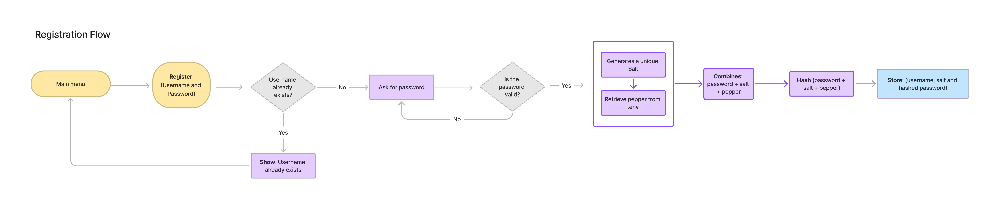
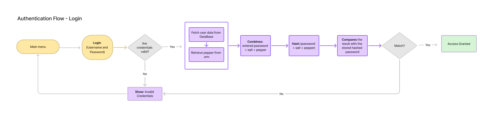

## Overview

This project is a Python CLI system for storing and validating user credentials using **hashing, salting, and peppering**.

 It was built from scratch to understand and apply real-world password protection practices, using **PBKDF2 with SHA-256**, environment-based **pepper**, and a **PostgreSQL database inside Docker**. The goal was to move beyond basic hashing and create a beginner-friendly, yet technically solid, example of how to handle credentials securely.

## Learning Motivation

When I started learning about secure password storage, I couldn’t find clear, beginner-friendly examples that combined **hash + salt + pepper** in a simple, real-world Python CLI project. So I decided to build one from scratch — to understand how each piece works and how to implement them together in a practical way.

- How and why to use hashing
- What role salt and pepper play in security
- How to securely store and validate credentials

<aside>

⚠️ This project was built for **learning purposes only** — to explore and understand secure password handling with **hash, salt, and pepper** using Python.

***Important Notes:***

- **Not for production** – This is a simplified implementation. It skips some best practices to focus on learning.
- **Secrets in `.env`** – In real projects, secrets should be stored in a **secure manager**, not a plain `.env` file.
- **No `docker-compose`** – I used only a basic Docker container for PostgreSQL to keep things simple and visual.
- **Schema created in code** – I used raw SQL in Python for table creation instead of tools.
- **Minimal structure** – All logic is grouped in a few modules for clarity. In production, proper layer separation would be required.
</aside>

## The Problem

Storing user credentials in a plain `.txt` file or even in a database, without any encryption or protection is a major security flaw. If someone gains access, they can easily read all user credentials (ex: passwords). This exposes users to identity theft, account breaches, and serious privacy risks.

## Concepts of Secure Data Storage

### What is Hashing?

A cryptographic *hash function* encodes data in a one-way,  irreversible format. The same input always produces the same fixed-length output. But there is no way to “reverse” the output and reveal the original input. Example:

→ `User password` = "MySecurePassword123"

→ The hash function will convert the password to bytes and hash it

→ `User password` hashed: a47ef47e8d5bd2852ef74bc1a0f8f0e38c1fa4c7aa9bd80f5b41bffbdd460a37

**Problem:** Using just hash can be a problem, If two users pick the same password like “123456789”, the hash for this users will be the same. This makes hash collisions more likely for identical passwords.

### What is Salting?

A salt is a random string unique to each user. Salting ensures every hashed password has a **unique value**, even if the plain text passwords are identical. This protects against precomputed “rainbow table” attacks that crack hashed passwords.

So basically, it’s a **random value** that we **generate** and **attach to the password before hashing**.

**1- You generate the salt ( I will explain later How )**

→ e.g. `"xyz789randomSalt"`

→ This is just a **random string**, unique for each user

**2- You combine the salt with the password**

→ e.g.`"MySecurePassword123"` (password)  + `"abc123randomsalt"` (salt)

→ Result: `"MySecurePassword123abc123randomsalt"`

**3- You then pass this combined string into the `hash function`**

→ So the salt is just **added into the input** of the hash — not hashed separately

### **Iterations**

In password hashing, **iterations** mean applying the hash function **multiple times in a row**, where each new hash uses the **result of the previous hash as input**.  Each new hash **doesn't re-hash the original password**. Instead, it re-hashes the **output** from the previous one. So yes, the **input** becomes different every time — but that’s the point.

This massively delays dictionary and brute force attacks.

example:

original password (password + salt + hash) → `"MySecurePassword123abc123randomsalt"`

***Iteration 1 → hash1 = ("***`MySecurePassword123abc123randomsalt`***")  = "c33a3752dcbe…”***

**`Hash 1** Output = ***"c33a3752dcbe…”***`

***Iteration 2 → hash2 = (“`c33a3752dcbe…`") = “b1f960a046ce…”***

**`Hash 2** Output = ***"b1f960a046ce…”***`

***Iteration 3 → hash3 =*** (”**`*b1f960a046ce…*`**”) = **“487e0fa52e16…”**

**`Hash 3** Output = ***"*487e0fa52e16…*”***`

You can now imagine the same thing happening **100,000 times** — only the last result is stored in the database.

### Pepper

**Pepper** is a secret value (a string) that is added to the user's password *before hashing for extra protection.* Unlike salts which are unique per user, the pepper is the same across all passwords. It provides an additional obstacle for leaked password databases. If the pepper isn’t known, brute forcing hashes is extremely difficult.

Even if someone steals the database (which includes salts and hashed passwords), they **still can’t recreate the original hash** without knowing the pepper. That’s because the **input to the hash is incomplete**.

example:

**1 – You retrieve the pepper from the system (usually from the `.env` file or a secrets manager)**

→ e.g. `"SECRET_PEPPER"`

→ This is a **secret string**, the same for every user, and **not stored in the database**

**2 – You combine the password, the salt, and the pepper**

→ e.g. `"MySecurePassword123"` (password)

- `"abc123randomsalt"` (salt)
- `"SECRET_PEPPER"` (pepper)

→ Result:

`"MySecurePassword123abc123randomsaltSECRET_PEPPER"`

## Python Credentials Storage Process

With these concepts in mind, let’s outline the secure credentials workflow:

### Registration – Storing Credentials

1. User enters their credentials (username and password)
2. System generates a unique salt
3. System retrieves the secret pepper from secure storage
4. System combines: password + salt + pepper
5. System hashes the combined string using multiple iterations (e.g. 150,000)
6. System stores in the database: username, salt, final hashed password



### Authentication Workflow (Login)

1. User enters their credentials (username and password)
2. System retrieves the stored salt and hashed password from the database
3. System retrieves the pepper from secure storage
4. System combines: entered password + stored salt + pepper
5. System hashes the combined string using the same number of iterations
6. System compares the result with the stored hashed password
7. If they match → access granted; otherwise → access denied



So now we’ll explore how each step is implemented in Python.

## Project Architecture

simple-login-system

- app/
    - config.py
    - credential_manager.py
    - main.py
- .env
- requirements.txt

## Implementation

### **1. Started with the CLI structure**

- I created a file called `main.py` inside the `app/` folder
- Built a simple **menu interface** that lets the user:
    - Register a new account
    - Log in to an existing account
    - Exit the program
- Used `input()` for user interaction
- Delegated actual logic (hashing, storing, verifying) to `credential_manager.py`

### 2. Install Dependencies

→ python-dotenv

→ psycopg2-binary

Add these dependencies to `requirements.txt`

***Python libraries:***

- `hashlib` for password hashing
- `secrets` for generating secure salt
- `os` for reading environment variables
- `hmac` for secure comparison

### **3. Designed Password Security Strategy**

At this point, I defined the **security plan** for how password storage would work:

- Use ***PBKDF2*** as the main password hashing function
- Use ***SHA-256*** as the internal algorithm inside PBKDF2
- Add a **unique salt** per user to make hashes different
- Add a **system-wide pepper** (from `.env`, not saved in DB)
- Configure **150,000 iterations** to slow down brute-force attacks

This approach makes password storage far more secure than basic hashing.

> **PBKDF2** is a cryptographic algorithm that uses **SHA-256** in multiple rounds to derive a secure hash. It combines the password + salt + pepper, and runs 150,000 iterations before producing the final output.
> 

## 4. Project Setup and Constants

### 4.1. Load Environment Variables and Define Constants

Preparing important configuration values that your program will use later.

- I **created a file** called `config.py` to centralize and manage all critical environment variables used across the application.
    
    ```python
    from dotenv import load_dotenv
    import os
    
    load_dotenv()
    
    def require_env(var_name: str) -> str:
        value = os.getenv(var_name)
        if not value:
            raise ValueError(f"Missing required environment variable: {var_name}")
        return value
    
    PEPPER = require_env("PEPPER").encode()
    HASH_NAME = os.getenv("HASH_NAME", "sha256")
    ITERATIONS = int(os.getenv("ITERATIONS", "150000"))
    DB_NAME = require_env("DB_NAME")
    DB_USER = require_env("DB_USER")
    DB_PASSWORD = require_env("DB_PASSWORD")
    DB_HOST = require_env("DB_HOST")
    
    ```
    
    - It uses `load_dotenv()` to load sensitive values from a `.env` file into the environment before anything else runs.
    - It defines a helper function `require_env()` that:
        - retrieves an environment variable,
        - and raises a `ValueError` if the variable is not set.
    - Values like `HASH_NAME` and `ITERATIONS` include default values:
        - `"sha256"` for the hashing algorithm,
        - `150_000` iterations for `pbkdf2_hmac()`.
- **Setup the `.env` file** at the root of the project ****to define sensitive values like `PEPPER` , database credentials and hashing parameters. These variables will be loaded using `config.py` and accessed throughout the application.
    
    ```python
    # File .env
    
    PEPPER="peppersecret"
    ITERATIONS = 150_000
    HASH_NAME = "sha256"
    
    DB_NAME="DB_NAME"
    DB_USER="DB_USER"
    DB_PASSWORD=securepassword
    DB_HOST=localhost
    ```
    
- I **created a file** called `credential_manager.py` to centralize all logic related to user authentication and database access.

## 5. Hashing Function

### 5.1 Create Hash Function

```python
def hash_password(password: str, salt: bytes) -> bytes:
	password_peppered = password.encode() + PEPPER
	return hashlib.pbkdf2_hmac(HASH_NAME, password_peppered, salt, ITERATIONS)
```

- It receives:
    - `password`: a user input as a regular string
    - `salt`: a secure, randomly generated value (in `bytes`) that makes each password hash unique
- Converts the password string into bytes using `.encode()`.
- Combines the user password with the secret `PEPPER` string.
- Calls `hashlib.pbkdf2_hmac()` using:
    - SHA-256 as the internal hashing algorithm,
    - the combined password + pepper,
    - the salt provided for this user,
    - 150,000 iterations.
- **Returns Bytes →** Hash is returned in binary format for DB storage or comparison.

## 6. Database Setup

### 6.1. Connect to PostgreSQL

```python
def get_connection():
    return psycopg2.connect(
        dbname=DB_NAME,
        user=DB_USER,
        password=DB_PASSWORD,
        host=DB_HOST,
        port=5432
    )
```

- Retrieves PostgreSQL connection settings from constants defined in `config.py`.

### 6.2. Initialise DataBase and Create User Table

```python
def setup_db_table():
    with get_connection() as conn:
        with conn.cursor() as cur:
            cur.execute("""
                CREATE TABLE IF NOT EXISTS users (
                    username TEXT PRIMARY KEY,
                    salt TEXT NOT NULL,
                    hashed_password TEXT NOT NULL
                );
            """)
            conn.commit()
```

- Creates the `users` table if it doesn’t exist.
- Creates a table with `username`, `salt` and `hashed_password`
- `salt` and `hash` are stored as hex strings.

## 7. User Registration

### 7.1. Store Credentials

```python
def store_credentials(username: str, password: str) -> None:
```

- The function takes two string arguments: `username` and `password`.
- **Input Validation**
    - Username is not empty and follows pattern.
    - Password is not empty and at least 8 characters.
    
    ```python
    # Validate Username
    
    if not username or not username.strip():
            raise ValueError("Username cannot be empty.")
        if not re.match(r"^[a-zA-Z0-9_]+$", username):
            raise ValueError("Username can only contain letters, digits, and underscores.")
            
            
     # Validate Password
     
        if not password or not password.strip():
            raise ValueError("Password cannot be empty.")
        if len(password) < 8:
            raise ValueError("Password must be at least 8 characters long.")
        if not re.match(r"^[a-zA-Z0-9_]+$", password):
            raise ValueError("Password can only contain letters, digits, and underscores.")
    ```
    
- **Generate Salt + Hash**
    
    ```python
    #Generate Unique Salt
    salt = secrets.token_bytes(16)
    
    #Hashed Password + Salt
    hashed = hash_password(password, salt)
    ```
    
    - Creates a 16-byte cryptographically secure random salt for this user.
    - Calls the `hash_password()` function with the salt and pepper included.
- **Store in DataBase**
    
    ```python
    with get_connection() as conn:
            with conn.cursor() as cur:
                cur.execute(
                    "INSERT INTO users (username, salt, hashed_password) VALUES (%s, %s, %s)",
                    (username, salt.hex(), hashed.hex())
                )
                conn.commit()
    ```
    
- Opens a DataBase connection
- Converts salt and hash to hex for storage
    
    ```python
    cur.execute(
                    "INSERT INTO users (username, salt, hashed_password) VALUES (%s, %s, %s)",
                    (username, salt.hex(), hashed.hex())
                )
    ```
    

## 8. Login and Validation

### 8.1. Authenticate User Credentials

```python
def verify_credentials(username: str, password: str) -> bool:
with get_connection() as conn:
        with conn.cursor() as cur:
```

- Takes two arguments:
    - `username`: the user’s login name
    - `password`: the password they typed into the CLI
- Returns `True` or `False` depending on whether authentication succeeds.
- Opens a DataBase connection
- **Fetch Stored Data**
    
    ```python
    cur.execute(
                    "SELECT salt, hashed_password FROM users WHERE username = %s",
                    (username,)
                )
                row = cur.fetchone()
    ```
    
    - Fetch the `salt` and `hashed_password` for the given `username`
    - `cur.fetchone()` retrieves the first matching row from the result (or `None` if not found).
- **Handle Unknown User**
    
    ```python
    if row is None:
       return False
    ```
    
    - If the username doesn’t exist in the DataBase authentication fails.
- **Hash Input Again**
    
    ```python
    # Decode Salt
    salt_hex, hashed_stored = row
    salt = bytes.fromhex(salt_hex)
    
    # Hash the input password
    hashed_input = hash_password(password, salt).hex()
    ```
    
    - The stored salt is in **hex format**, so it converts it back to `bytes` using `.fromhex()`.
    - Recomputes the hash using the input `password` and the retrieved `salt`.
    - `.hex()` converts the output to match the stored format in DataBase.
- **Compare Hashes**
    
    ```python
    return hmac.compare_digest(hashed_input, hashed_stored)
    ```
    
    - Compares the freshly computed hash with the stored hash.
    - `hmac.compare_digest()` used to avoid timing attacks.

## 9. Username Checks

### 9.1. Check if user already exists

```python
def user_exists(username: str) -> bool:
```

- Takes one argument `username`
    - Returns `True` or `False` if user already exist.
- **Open DataBase connection**
    
    ```python
    with get_connection() as conn:
    	    with conn.cursor() as cur:
    ```
    
- **Run Existence Query**
    
    ```python
    cur.execute(
                    "SELECT 1 FROM users WHERE username = %s",
                    (username,)
                )
    ```
- **Check Result**
    
    ```python
    return cur.fetchone() is not None
    ```