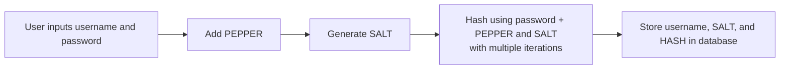
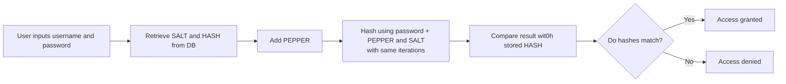

**Built With:** Python 3.12, PostgreSQL, Docker  
**Security Focus:** Hashing + Salting + Peppering  

## Overview

This project is a Python CLI-based authentication system for storing and validating user credentials using **hashing, salting, and peppering**.

## Learning Motivation

When I started learning about secure password storage in Python, I couldn’t find clear, beginner-friendly examples that combined **hash + salt + pepper** in a simple, real-world Python CLI project. So I decided to build one from scratch, to understand how each piece works and how to implement them together in a practical way.

- How and why to use hashing
- What role salt and pepper play in security
- How to securely store and validate credentials

> [!WARNING]
> This project was built for **learning purposes only** — to explore and understand secure password handling with **hash, salt, and pepper** using Python.
> - **Not for production** – This is a simplified implementation. It skips some best practices to focus on learning.
> - **Secrets in `.env`** – In real projects, secrets should be stored in a **secure manager**, not a plain `.env` file.

## The Problem

Storing user credentials in a plain `.txt` file or even in a database, without any encryption or protection is a major security flaw. If someone gains access, they can easily read all user credentials (ex: passwords). This exposes users to identity theft, account breaches, and serious privacy risks.

## Concepts of Secure Data Storage

### What is Hashing?

A cryptographic hash function is a one-way function that transforms input data *(such as a password)* into a fixed-length string of characters, but there is no way to “reverse” the output and reveal the original input. Typically represented in hexadecimal.

Hashing is essential for password storage because it allows systems to verify passwords *without ever storing the original password itself*. Instead, the system stores the hash, and when the user logs in, the input is hashed again and compared.

#### How hashing works:

>**User password** *(Input)* = "MySecurePassword123"

The hash function will convert the `User password` *(MySecurePassword123)* to bytes and hash it.

>**User password** *hashed*: a47ef47e8d5bd2852ef74bc1a0f8f0e38c1fa4c7aa9bd80f5b41bffbdd460a37

> [!IMPORTANT]  
> However, using hashing alone is not secure enough, if two users pick the same password, the hash for this users will be the same. This makes hash collisions more likely for identical passwords. 
>
>Attackers can use precomputed tables (like rainbow tables) or brute-force methods to reverse common hashes. That’s why secure implementations also use **salt**, **pepper**, and **iterations** to strengthen the hash.

### What is Salting?

Salting is the process of adding a unique, randomly generated value (called a salt) to each user's password before hashing it. This ensures that even if two users choose the same password, their stored hashes will be different.

Salting protects against:
- **Rainbow table attacks** (precomputed hashes of common passwords)

- **Hash collisions** for users with identical passwords

So basically, it’s a **random value** that we **generate** and **attach to the password before hashing**.

**1. Generate a unique salt** *( I will explain later how )*

A cryptographically random byte string is generated for *each user*.

Example of a salt string:

> "xyz789randomSalt"

This is just a random string, it should be different for every *single user*.

**2. Combine password and salt**

The password and salt are combined — not by merging them as text, but during hashing. The salt is used as part of the hashing process, not just glued onto the password.

**3. Hash the combination**

>**→ Output hash:** "a47ef47e8d5bd2852ef74bc1a0f8f0e38c1fa4c7aa9bd80f5b41bffbdd460a37"

So the salt isn’t hashed by itself, it’s part of the password input before hashing. It simply makes each hash result unique, even if two users have the same password.

### Pepper

Pepper is a secret string added to the password before hashing, but **never stored in the database.**

While salts are unique per user and saved alongside the hash, pepper is the ***same for all users*** and kept hidden — usually in a secure secrets manager or a `.env` file.

It provides extra protection, even if an attacker steals the database *(with all salts and password hashes)*, they still can’t recreate the hash without knowing the pepper. That’s because the **input to the hash is incomplete**.

#### How pepper works:

**1. Retrieve the pepper**

Retrieve the pepper stored in `.env` or a secrets manager:

> PEPPER="SECRET_PEPPER"

→ This is a **secret string**, the same for every user, and **not stored in the database**

**2. Combine password + pepper**

>***User password:*** "MySecurePassword123"  
>
> ***Secret Pepper from .env:***  "SECRET_PEPPER"

→ **Combined value:**  "MySecurePassword123SECRET_PEPPER"

This combination encoded to bytes and passed into the hash function.

**3. Encode and hash**
The combined string is encoded to bytes and sent into the hash function — later, the salt is added as a separate argument inside the hash process *(you’ll see this next)*.

The salt is added to the combination during the hashing process.

### **Iterations**

In password hashing, **iterations** mean applying the hash function **multiple times in a row**, where each new hash uses the **result of the previous hash as input**.  Each new hash **doesn't re-hash the original password**. Instead, it re-hashes the **output** from the previous one. So yes, the **input** becomes different every time — but that’s the point.

This massively delays dictionary and brute force attacks.

#### How iteractions work:

Let's say the input to the hash is:

    "MySecurePassword123abc123randomsalt"

I'm applying a simplified 3-step iteration example *(in reality, need to use something like 150,000 iterations)*:

***Iteration 1:***

Hash the original input:

> ***hash1 =*** ("MySecurePassword123abc123randomsalt") 

→ **Output:** `"c33a3752dcbe..."`

***Iteration 2:***

Now take the output of the `hash1` and hash it again:

> ***hash2 =*** ("c33a3752dcbe...")

→ **Output:** `"b1f960a046ce..."`

***Iteration 3:***

Now take the output of the `hash2` and hash it again:

> ***hash3 =*** ("b1f960a046ce...")

→ **Output:** `"487e0fa52e16..."`

Each iteration uses the result (output) of the previous one — not the original password again. Only the final output (after all iterations) is stored in the database.


## Python Credentials Storage Process

With these concepts in mind, let’s outline the secure credentials workflow:

### Registration – Storing Credentials

1. User enters their credentials (username and password)

2. System generates a unique salt
3. System retrieves the secret pepper from secure storage
4. System combines: password + pepper 
5. System hashes the result using the salt and multiple iterations (e.g. 150,000)
6. System stores in the database:
    - `Username` -> as text
    - `Salt` -> hex-encoded
    - `hashed password` -> hex-encoded


```mermaid
graph LR
  A[User inputs username and password] --> B[Add PEPPER]
  B --> C[Generate SALT]
  C --> D[Hash using password + PEPPER and SALT<br/>with multiple iterations]
  D --> E[Store username, SALT, and HASH in database]
```

### Authentication Workflow (Login)

1. User enters their credentials (username and password)

2. System retrieves the stored salt and hashed password for that user from the database
3. System retrieves the pepper from (`.env` or a secrets manager)
4. System combines: entered password + pepper
5. System re-hashes this combination using the stored salt and same iterations
6. System compares the result with the stored hashed password
7. Access granted or denied
    - **Match ->** User authenticated
    - **Mismatch ->** invalid password

So now we’ll explore how each step is implemented in Python.


```mermaid
graph LR
  A[User inputs username and password] --> B[Retrieve SALT and HASH from DB]
  B --> C[Add PEPPER]
  C --> D[Hash using password + PEPPER and SALT<br/>with same iterations]
  D --> E[Compare result wit0h stored HASH]
  E --> F{Do hashes match?}
  F -- Yes --> G[Access granted]
  F -- No --> H[Access denied]
```

## Project Structure

SECURE-AUTH-STORAGE
- src/
    - main.py -> CLI entry point / user interface
    - auth.py -> Handles authentication logic and validation
    - db.py -> DataBase setup
    - password.py -> Password hashing and verification
    - settings.py -> Loads environment variables 
    - logger.py -> setting up logging behaviour 

    - tests/
- .env
- requirements.txt
- docker-compose.yml
- README.md


## Implementation

### 1. Install Dependencies

→ python-dotenv

→ psycopg2-binary

Add these dependencies to `requirements.txt`

***Python libraries:***

- `hashlib` for password hashing
- `secrets` for generating secure salt
- `os` for reading environment variables
- `hmac` for secure comparison
- `getpass` prompts the user for a password without echoing

### **2. Designed Password Security Strategy**

At this point, I defined the **security plan** for how password storage would work:

- Use ***PBKDF2*** as the main password hashing function
- Use ***SHA-256*** as the internal algorithm inside PBKDF2
- Add a **unique salt** per user to make hashes different
- Add a **system-wide pepper** (from `.env`, not saved in DB)
- Configure **150,000 iterations** to slow down brute-force attacks

This approach makes password storage far more secure than basic hashing.

> **PBKDF2** is a cryptographic algorithm that uses **SHA-256** in multiple rounds to derive a secure hash. It combines the password + salt + pepper, and runs 150,000 iterations before producing the final output.
> 

## 4. Project Setup and Constants

### 4.1. Started with the CLI structure

- I created a file called `main.py` inside the `src/` folder;
- In the `main.py` file I builted a simple **menu interface** that lets the user:
    - Register a new account
    - Log in to an existing account
    - Exit the program
- Used `input()` for user interaction
- Delegated all actual logic *(validation, hashing, storage, verification)* to `auth.py`, `password.py` and `db.py`

### 4.2. Load Environment Variables and Define Constants

I **created a file** called `settings.py` to centralize and manage environment variables used across the application.
    
```python
    from dotenv import load_dotenv
    import os
    
    load_dotenv()
    
    def require_env(var_name: str) -> str:
        value = os.getenv(var_name)
        if not value:
            raise ValueError(f"Missing required environment variable: {var_name}")
        return value
    
    PEPPER = require_env("PEPPER").encode()
    HASH_NAME = os.getenv("HASH_NAME", "sha256")
    ITERATIONS = int(os.getenv("ITERATIONS", "150000"))
    DB_NAME = require_env("DB_NAME")
    DB_USER = require_env("DB_USER")
    DB_PASSWORD = require_env("DB_PASSWORD")
    DB_HOST = require_env("DB_HOST")
```
    
- Uses `load_dotenv()` to load sensitive values from a .env file.
- Defines `require_env()` to validate that required variables are set.
- Values like `HASH_NAME` and `ITERATIONS` include default values:                                    -
- Default values are provided for: 
    - `HASH_NAME` = "sha256"
    - `ITERATIONS` = 150_000
- **Setup the `.env` file** at the root of the project to define sensitive values like `PEPPER` , database credentials and hashing parameters. These variables will be loaded using `settings.py` and accessed throughout the application.

Your `.env` file might look like this:
    
```python
    # File .env

    PEPPER="SECRET_KEY"
    ITERATIONS = 150000
    HASH_NAME = "sha256"

    PYTHONPATH=src

    DB_NAME=login_system
    DB_USER=auth_user
    DB_PASSWORD=mysecurepassword
    DB_HOST=localhost
```
## 5. Hashing Function

### 5.1 Create Hash Function

**Defined in:** `password.py`

```python
def hash_password(password: str, salt: bytes) -> bytes:
    try:
        password_peppered = password.encode() + PEPPER
        return hashlib.pbkdf2_hmac(HASH_NAME, password_peppered, salt, ITERATIONS)
```

- It receives:
    - `password`: a user input as a regular string
    - `salt`: a secure, randomly generated value (in `bytes`) that makes each password hash unique
- Converts the password string into bytes using `.encode()`.
- Combines the user password with the secret `PEPPER` string.
- Calls `hashlib.pbkdf2_hmac()` using:
    - SHA-256 as the internal hashing algorithm,
    - the combined password + pepper,
    - the salt provided for this user *(I will explain how it's generated later in the registration section.)*
    - 150,000 iterations.
- **Returns Bytes →** Hash is returned in binary format for DB storage or comparison.

## 6. Database Setup

### 6.1. Connect to PostgreSQL

**Defined in:** `db.py`
```python
def get_connection():
    return psycopg2.connect(
        dbname=DB_NAME,
        user=DB_USER,
        password=DB_PASSWORD,
        host=DB_HOST,
        port=5432
    )
```

- Retrieves PostgreSQL connection settings from constants defined in `settings.py`.

### 6.2. Query Functions

**Defined in:** `db.py`

***Select* Query:**

```python
def select_db(query: str, vars, func_name: str):
    try:
        with get_connection() as conn:
            with conn.cursor() as cur:
                cur.execute(query, vars)
                return cur.fetchall()
    except psycopg2.Error as e:
        logger.error(f"Database error during {func_name}: {e}")
        raise
```
***Insert* Query:**

```python
def insert_db(query: str, vars, func_name:str):
    try:
        with get_connection() as conn:
            with conn.cursor() as cur:
                cur.execute(query,vars)
                conn.commit()
               
    except psycopg2.Error as e:
        logger.error(f"Database error during {func_name}: {e}")
        raise
```
- Both functions handle exceptions and log errors using the `func_name` passed in the call.

- `insert_db()` is used for **INSERT**, **CREATE**, and other write operations.

- `select_db()` is used for fetching data from the database.

### 6.3. Initialise DataBase table

**Defined in:** `db.py`

```python
def setup_user_table():
    insert_db(
        "CREATE TABLE IF NOT EXISTS users (username TEXT PRIMARY KEY, salt TEXT NOT NULL, hashed_password TEXT NOT NULL);",
        (),
        "setup_user_table"
    )
    logger.info("Users table initialized.")
```

- Creates the users table with `username`, `salt`, and `hashed_password`

- Uses `insert_db()` for creation logic

- Logs a message when the table is ready


## 7. User Registration

### 7.1. Store Credentials


**Defined in:** `auth.py`

```python
def store_credentials(username: str, password: str) -> None:
```

- The function takes two string arguments: `username` and `password`.

- **Input Validation:**

```python
# Validate Username

if not username.strip():
        raise ValueError("Username cannot be empty.")
    if not is_valid_username(username):
        raise ValueError("Username can only contain letters, digits, and underscores.")

# Validate Password

    if not password.strip():
        raise ValueError("Password cannot be empty.")
    if not is_valid_password(password):
        raise ValueError("Password must be at least 8 characters long.")
```

- **Generate Salt + Hash:**

```python
# Generate Salt
salt = secrets.token_bytes(16)

# Hashed Password + Salt
hashed = hash_password(password, salt)
```
- Uses `secrets.token_bytes(16)` to generate a secure salt.

- Hashes the password using the salt and pepper with `hash_password()` from `password.py`


- **Store in DataBase:**
    
```python
insert_db("INSERT INTO users (username, salt, hashed_password) VALUES (%s, %s, %s)", 
              (username, salt.hex(), hashed.hex(),), "store_credentials")

logger.info(f"User '{username}' registered successfully.")
```
- Converts both salt and hash to hexadecimal before storing in the database.

- Uses `insert_db()` for insertion and logging.

- Logs a success message after registration

## 8. Login and Validation

### 8.1. Authenticate User Credentials

```python
def verify_credentials(username: str, password: str) -> bool:
```
- Takes two arguments:
    - `username`: the user’s login name
    - `password`: the password that user typed into the CLI
- Returns `True` or `False` depending on whether authentication succeeds.

- **Fetch Stored Data:**

```python
result = select_db(
    "SELECT salt, hashed_password FROM users WHERE username = %s",
    (username,),
    "verify_credentials"
    )
```
 - Uses `select_db()` to retrieve `salt` and `hashed_password` for the given user.
 
- **Handle Unknown User**

```python
if not result:
        logger.warning(f"Login attempt for non-existent user: '{username}'")
        return False
```
- If user does not exist, logs a warning and returns `False`

- **Compare Hashes**
    
    ```python
    salt, stored_hash = bytes.fromhex(result[0][0]), result[0][1]
    return verify_password(password, salt, stored_hash)
    ```
    
    - The stored salt is in **hex format**, so it converts it back to `bytes` using `.fromhex()`.
    - Calls `verify_password()` from `password.py` to compare the freshly computed hash with the stored hash.

## 9. Username Checks

### 9.1. Check if user already exists

**Defined in:** `auth.py`

```python
def user_exists(username: str) -> bool:
```
- Takes one argument `username`
- Returns `True` or `False` if user already exist.
    
- **Run Existence Query**
    
```python
result = select_db("SELECT COUNT(*) FROM users WHERE username = %s", (username,), "user_exists")
return result[0][0] > 0 
```
- Used `select_db()` to check if a user with the given username exists
- The query returns a count of matching rows, and the function returns `True` if that count is greater than zero

## How to run
Before you start, make sure you have **Docker installed and running** on your machine.

This project uses Docker to run a PostgreSQL database. You do **not** need to install PostgreSQL manually — the database will run inside a container defined by the `docker-compose.yml` file (which is already included in this repository).

### 1. Clone the repository and setup environment:

First, **clone the repository** and then in your terminal, run the following:

```bash
cd secure-auth-storage
```
```bash
cp .env.example .env
```
This will:

- Move you into the project folder

- Create your own `.env` configuration file based on the example provided.

> [!IMPORTANT] 
> Don't forget to update the `.env` file with your custom secrets if needed (like the PEPPER and DB credentials).

### 2. Start the database using Docker:

Make sure the `docker-compose.yml` file is in the project root — it's already included in this repository.

Then, run:

```bash
docker-compose up -d
```
This command will launch a PostgreSQL database container in the background, using the configuration defined in the `docker-compose.yml` file.

### 3. Run the CLI application

in your terminal, run the following:

```bash
export PYTHONPATH=src
```

```bash
python3 src/main.py
```
The CLI will start, and you’ll be able to register and log in users through a clean terminal interface.
