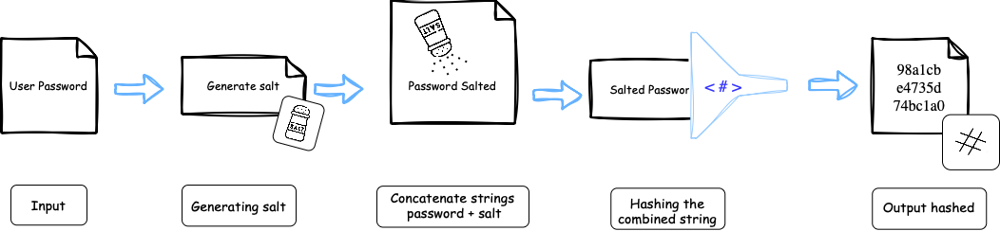
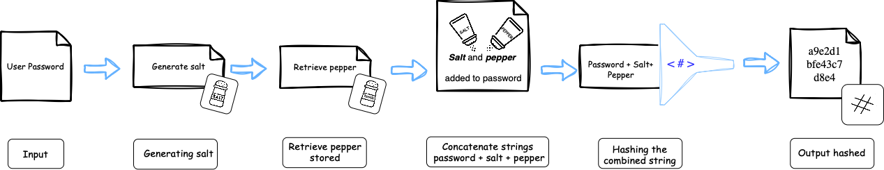

# The Problem

Storing user credentials in a plain `.txt` file or even in a database, without any encryption or protection is a major security flaw. If someone gains access, they can easily read all user credentials. This exposes users to identity theft, account breaches, and serious privacy risks.

# Concepts of Secure Data Storage

## What is Hashing?

Hashing is a process that takes an input ***(like a password)*** and turns it into a long, fixed-length string of characters. This string is called a hash.

Once something is hashed, you can’t reverse it to get the original input. That’s why it’s called a one-way function — it's like putting something through a shredder with no way to put the pieces back together.

Hashing is important for password storage because it means the system never has to save your actual password. Instead, it saves only the hash.


### How hashing works
---

>
> → **User password:** *(input)* = "MySecurePassword123"
> 

The hash function will convert the `User password` *(MySecurePassword123)* to bytes and hash it.

>
> → **User password:** *(Hashed)* = "a47ef47e8d5bd2852ef74bc1a0f8f0e38c1fa4c7aa9bd80f5b41bffbdd460a37"
>

<p align="center">
  
</p>

> [!IMPORTANT]
>
> However, using hashing alone is not secure enough, if two users pick the same password, the hash for this users will be the same. This makes hash collisions more likely for identical passwords.
>
> Attackers can use <a href="#rainbow-tables"> precomputed tables (rainbow tables)</a> or <a href="#brute-force-methods"> brute-force methods</a> to reverse common hashes. That’s why secure implementations also use **salt**, **pepper**, and **iterations** to strengthen the hash.

<details>
<summary id ="rainbow-tables"><u><b>Precomputed Tables (Rainbow Tables)</b></u></summary>
<p></p>
<p><b><u>Definition:</u></b></p>
<p>
These are lookup tales that store precomputed hashes for a large list of possible passwords. Instead of hashing guesses one by one, the attacker looks up the hash in the table and finds the corresponding password.</p>

> ***Rainbow*** refers to the different colors used in the table to show the various hashing and reduction functions and steps. With each reduction function being a different color, the final plaintexts and hashes would look like a rainbow.

<b><u>How it works:</u></b>

<b>1.</b> The attacker creates a big list of passwords (like from a dictionary).

<b>2.</b> They compute the hash of each one.

<b>3.</b> Store in a table:
```bash
password → hash  
"123456" → e10adc3949ba59abbe56e057f20f883e
```
<b>4.</b> Later, if they find a password hash (e.g. from a database leak), they can search in the table to reverse it.
</details>

<details>
<summary id ="brute-force-methods"><u><b>Brute Force Methods</b></u> </summary>
<p>
A brute-force attack is a method where an attacker tries every possible combination of characters until the correct one is found. It’s slow but guaranteed to work eventually, if there's no protection like account lockouts or rate limiting.</p>

> They try every possible combination until one works. The attacker doesn’t need to know anything about the password, they just try everything.

<b><u>How it works:</u></b>
<p></p>
<b>1.</b> The attacker knows the hash of a password (e.g., from a leaked database).

<b>2.</b> They pick a list of possible characters: `abcdefghijklmnopqrstuvwxyzABCDEFGHIJKLMNOPQRSTUVWXYZ0123456789!@#$%`

<b>3.</b> They generate passwords starting from shortest to longest:
  - a
  - b
  - c
  - aa
  - ab
  - etc ....

<b>4.</b> Each guess is hashed and compared with the stored hash.

<b>5.</b> If it matches, they found the original password.
</details>

## What is Salting?

Salting is the process of adding a unique, randomly generated value to each user's password *before hashing it*. This ensures that even if two users choose the same password, their stored hashes will be different.

***Salting protects against:***

-  **Rainbow table attacks:** because salt breaks the predictability rainbow tables rely on. Every salt makes a new version of the hash, which leads to precomputed tables no longer match.

- **Hash Reuse:** salt prevents hash reuse because it changes the input for every user, so even identical passwords generate different hashes, making patterns invisible to attackers.

In summary, it's a <u>random value</u> that is <u>generate</u> and <u> attach</u> to the password before hashing.

### How salting works
--- 

<b>1. User creates a password (input):</b>

```bash
password = "MySecurePassword123"
```
<b> 2. Generate a unique salt *(per user)*</b>

The salt is generated using a **cryptographically function**, that generate a random byte string for each user.

> Example of a salt string (output):

```bash
"xyz789randomSalt"x
```
<b> 3. Combine password and salt (Concatenation):</b>

The salt is combined with the password, typically by concatenating them. This creates a unique input for hashing.

```bash
password + salt = "MySecurePassword123xyz789randomSalt"
```

<b> 4. Hash the combined string:</b>

The combined *password* and *salt* are passed through a cryptographic **hash function**, which produces a fixed-length string (hash).

```bash
Combined password + salt ("xyz789randomSaltMySecurePassword123") 
↓
Hash Output= ("98a1cbe4735d...")
```
<b> 5. Store the salt and the hash in the Database:</b>

The salt and the resulting hash are stored in the database.

```bash
  "username": "Amy",
  "salt": "xyz789randomSalt",
  "hash": "98a1cbe4735d..."
```

<p align="center">
  
</p>

## What is Pepper?

Pepper is a secret string, that can be used in addition to salting to provide an additional layer of protection. While salts are unique per user and saved alongside the hash, pepper is the ***same for all users*** and kept hidden, usually in a secure secrets manager or a `.env` file. Like any other cryptographic key, a pepper rotation strategy should be considered.

Even if an attacker gains access to the database *(with all salts and password hashes)*, they still can’t recreate the hash without knowing the pepper. That’s because the **input to the hash function is incomplete**.

### How pepper works
---

<b>1. User creates a password (input):</b>

```bash
password = "MySecurePassword123"
```

<b> 2. Generate a unique salt *(per user)*</b>

```bash
"xyz789randomSalt"
```

<b> 3. Retrieve the pepper stored</b>

Retrieve the pepper stored in `.env` or a secrets manager:

```Python
"PEPPER = "SECRET_PEPPER""
```
<b> 4. Combine password, salt and pepper (Concatenation) </b>

The pepper is combined with the password and salt, typically by concatenating them. This creates a unique input for hashing.

```bash
password + salt + pepper = "MySecurePassword123xyz789randomSaltSECRET_PEPPER"
```
<b> 4. Hash the combined string:</b>

The combined *password*, *salt* and *pepper* are passed through a cryptographic **hash function**, which produces a fixed-length string (hash).

```bash
Combined password + salt + pepper ("MySecurePassword123xyz789randomSaltSECRET_PEPPER") 
↓
Hash Output= ("a9e2d1bfe43c7d8e...")
```
<b> 5. Store the salt and the hash in the Database:</b>

The salt and the resulting hash are stored in the database.

```bash
  "username": "Amy",
  "salt": "xyz789randomSalt",
  "hash": "a9e2d1bfe43c7d8e..."
```
<p align="center">
  
</p>