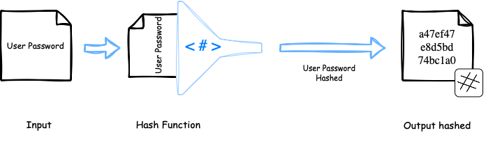

# The Problem

Storing user credentials in a plain `.txt` file or even in a database, without any encryption or protection is a major security flaw. If someone gains access, they can easily read all user credentials. This exposes users to identity theft, account breaches, and serious privacy risks.

# Concepts of Secure Data Storage

## What is Hashing?

Hashing is a process that takes an input ***(like a password)*** and turns it into a long, fixed-length string of characters. This string is called a hash.

Once something is hashed, you can’t reverse it to get the original input. That’s why it’s called a one-way function — it's like putting something through a shredder with no way to put the pieces back together.

Hashing is important for password storage because it means the system never has to save your actual password. Instead, it saves only the hash.


### How hashing works:

> :: **User password:** *(input)* = "MySecurePassword123"

The hash function will convert the `User password` *(MySecurePassword123)* to bytes and hash it.

> :: **User password:** *(Hashed)* = "a47ef47e8d5bd2852ef74bc1a0f8f0e38c1fa4c7aa9bd80f5b41bffbdd460a37"

<p align="center">
  
</p>

> [!IMPORTANT]
>
> However, using hashing alone is not secure enough, if two users pick the same password, the hash for this users will be the same. This makes hash collisions more likely for identical passwords.
>
> Attackers can use <a href="#rainbow-tables"> precomputed tables (rainbow tables)</a> or <a href="#brute-force-methods"> brute-force methods</a> to reverse common hashes. That’s why secure implementations also use **salt**, **pepper**, and **iterations** to strengthen the hash.

<details>
<summary id ="rainbow-tables"><u>Precomputed Tables (Rainbow Tables)</u></summary>
These are lookup tales that store precomputed hashes for a large list of possible passwords. Instead of hashing guesses one by one, the attacker looks up the hash in the table and finds the corresponding password.

> ***Rainbow*** refers to the different colors used in the table to show the various hashing and reduction functions and steps. With each reduction function being a different color, the final plaintexts and hashes would look like a rainbow.

**How it works:**
----
1. The attacker creates a big list of passwords (like from a dictionary).

2. They compute the hash of each one.

3. Store in a table:
```bash
password → hash  
"123456" → e10adc3949ba59abbe56e057f20f883e
```
4. Later, if they find a password hash (e.g. from a database leak), they can search in the table to reverse it.
</details>

<details>
<summary id ="brute-force-methods"><u>Brute Force Methods</u> </summary>
A brute-force attack is a method where an attacker tries every possible combination of characters until the correct one is found. It’s slow but guaranteed to work eventually, if there's no protection like account lockouts or rate limiting.

> They try every possible combination until one works. The attacker doesn’t need to know anything about the password, they just try everything.

**How it works:**
---
1. The attacker knows the hash of a password (e.g., from a leaked database).

2. They pick a list of possible characters: `abcdefghijklmnopqrstuvwxyzABCDEFGHIJKLMNOPQRSTUVWXYZ0123456789!@#$%`

3. They generate passwords starting from shortest to longest:
  - a
  - b
  - c
  - aa
  - ab
  - etc ....
4. Each guess is hashed and compared with the stored hash.

5. If it matches, they found the original password.

</details>