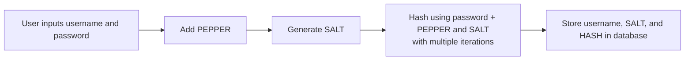

# Python Credentials Storage Process

This document explains how the authentication flow works in the Secure Auth Storage CLI, including how user credentials are processed, hashed, and validated.

## Registration Workflow - storing credentials

<b>1. <u>User enters their credentials:</u></b>
  - Username 
  - Password

<b>2. <u>Input Validation</u></b>

<b>3. <u>System generates a unique salt</u></b>

<b>4. <u>System retrieves the pepper stored</u></b>

<b>5. <u>System combines: password + salt + pepper</u></b>

<b>6. <u>Combine and Hash</u></b>
  - Combine `password + salt + pepper`
  - Hash combination and apply iterations (e.g. 150,000 iterations)

<b>6. <u>System stores in the database:</u></b>
  - `Username` 
  - `Salt`
  - `hashed password` 

