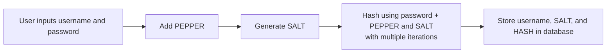
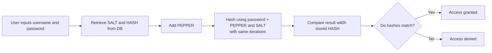

# Python Credentials Storage Process

This document explains how the authentication flow works in the Secure Auth Storage CLI, including how user credentials are processed, hashed, and validated.

## Registration Workflow - storing credentials

<b>❶. <u>User enters their credentials:</u></b>
  - Username 
  - Password

<b>❷. <u>Input Validation</u></b>

<b>❸. <u>System generates a unique salt</u></b>

<b>❹. <u>System retrieves the pepper stored</u></b>

<b>❺. <u>System combines: password + salt + pepper</u></b>

<b>❻. <u>Combine and Hash</u></b>
  - Combine `password + salt + pepper`
  - Hash combination and apply iterations (e.g. 150,000 iterations)

<b>❼. <u>System stores in the database:</u></b>
  - `Username` 
  - `Salt`
  - `hashed password` 

## Authentication Workflow - Login

<b>1. <u>User enters their credentials:</u></b>
  - Username 
  - Password

<b>2. <u>Retrieve Stored Values</u></b>
  - Fetch `salt` and `hashed_password` from database
  - Retrieves pepper stored

<b>3. <u>Re-Hash the input</u></b>
  - Combine entered password + pepper + stored salt - just like it did during registration
  - Hash it again using the same number of iterations

<b>4. <u>Compare Hashes</u></b>

  - **Then it checks:** does this new hash equal the one stored in the database?
  
    - If yes → login is successful
    - If not → access is denied

