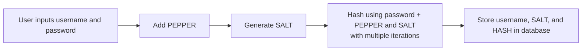

# Python Credentials Storage Process

This document explains how the authentication flow works in the Secure Auth Storage CLI, including how user credentials are processed, hashed, and validated.

## Registration Workflow - storing credentials

### 1. User enters their credentials:
  - Username 
  - Password

### 2. Input Validation

### 3. System generates a unique salt

### 4. System retrieves the pepper stored

### 5. System combines: password + salt + pepper

### 6. Combine and Hash
  - Combine `password + salt + pepper`
  - Hash combination and apply iterations (e.g. 150,000 iterations)

### 6. System stores in the database:
  - `Username` 
  - `Salt`
  - `hashed password` 

